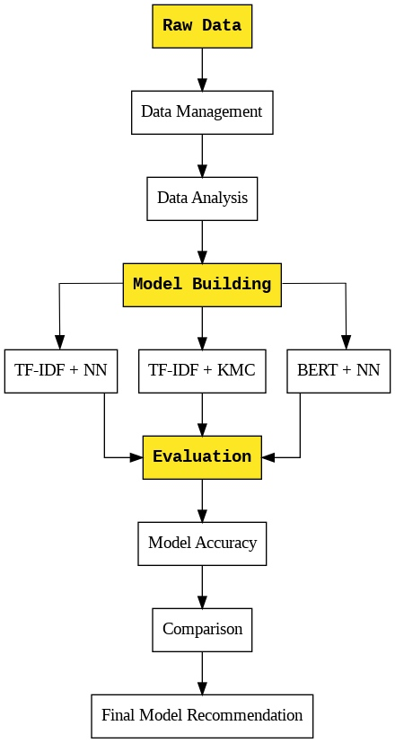
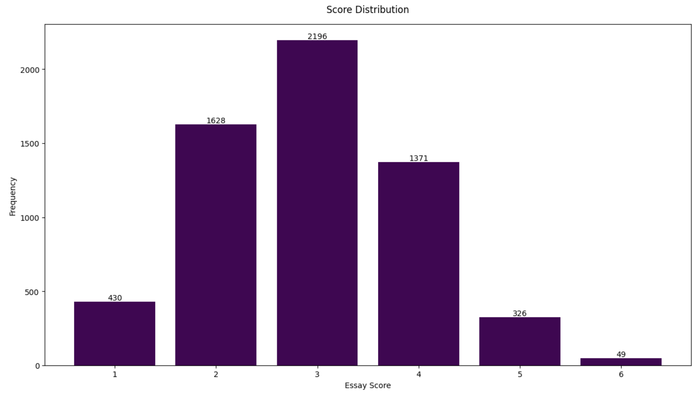
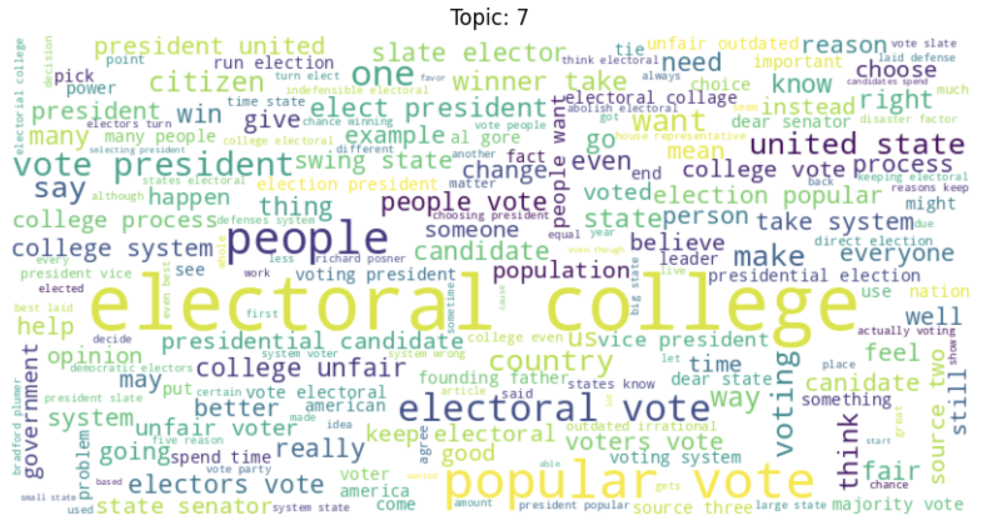
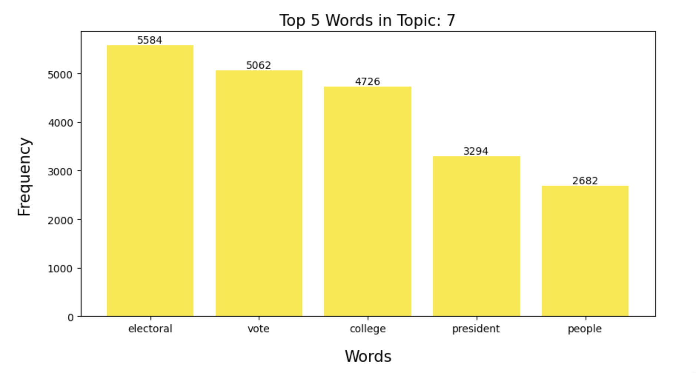

# Kaggle Competition: Automated Essay Scoring

This project was completed as the final Phase 4 assessment in the Flatiron School’s Data Science Bootcamp. 

Analysis by Erin Wasserman, June 2024

# Overview

The first automated essay scoring competition to tackle automated grading of student-written essays was twelve years ago. How far have we come from this initial competition? With an updated dataset and light years of new ideas we hope to see if we can get to the latest in automated grading to provide a real impact to overtaxed teachers who continue to have challenges with providing timely feedback, especially in underserved communities.

The goal of this competition is to train a model to score student essays. Your efforts are needed to reduce the high expense and time required to hand grade these essays. Reliable automated techniques could allow essays to be introduced in testing, a key indicator of student learning that is currently commonly avoided due to the challenges in grading.(Kaggle)

Based on this analysis, which is explained below, are the following three recommendations:

1. Adopt the BERT-Based Model
2. Address Overfitting in Neural Network Models
3. Increase Training Data Size


# Business Problem

The Educational Testing Industry is developing a tool to assist with evaluating student learning and performance on short answer responses and essays on standardized tests. Manual grading of essays is not only time-consuming but also resource-intensive, making it difficult for educators to provide timely feedback, especially in underserved communities. Automated Writing Evaluation (AWE) systems offer a solution by efficiently scoring essays and supplementing educators' efforts, allowing students to receive regular and prompt feedback on their writing.

This project supports the technical development team to explore several key model training and performance questions:

1. What are the optimal hyperparameters for the models tested?
2. How do different vectorization techniques (e.g., TF-IDF vs. BERT) impact the model's performance?
3. What is the effect of different model architectures on grading accuracy?

# Data Understanding

**Dataset Description**

[Kaggle Dataset](https://www.kaggle.com/competitions/learning-agency-lab-automated-essay-scoring-2/data) <br>
The competition dataset comprises about 24000 student-written argumentative essays. Each essay was scored on a scale of 1 to 6 (Link to the Holistic Scoring Rubric rubric). The goal is to predict the score an essay received from its text.


test.csv - The essays to be used as test data. Contains the same fields as train.csv, aside from exclusion of score. (Note: The rerun test set has approximately 8k observations.)

**Data Features**

List of Feature (or attributes, either work) Descriptions

- essay_id : The unique ID of the essay
- full_text : The full essay response
- score : Holistic score of the essay on a 1-6 scale

**Data Splits**

- The dataset was randomly split into training (80%) and test (20%) sets to evaluate model performance.

**Data Licensing and Usage**

- [Database: Open Database, Contents: Copyright Original Authors](https://creativecommons.org/licenses/by-nc/4.0/)

# Methodology



## Data Preparation

**Data Cleaning and Preprocessing**
- Tokenization and text normalization were performed, including handling contractions, punctuation, and numeric values.
- Stop words were removed to improve the quality of the text data.
- Histograms and bar plots were used to visualize the score distribution and inform preprocessing steps.



## Modeling

- TF-IDF Vectorization with Neural Network
- TF-IDF Vectorization with K-Means Clustering
- BERT Embeddings with Neural Network

Topic Modeling with K-means Clustering:

<br>
<br>
Sample, Essay Topic 7 Word Cloud:

<br>
<br>
Sample, Essay Topic 7 Bar Chart:


# Evaluation

- Train-test split for model evaluation
- Accuracy metrics for both training and test datasets
- Detailed comparison of model performance in a tabular format

## Limitations

- Subjective interpretation of the grading rubric by human evaluators introduces variability and potential bias in training labels.
- Dataset may not fully capture the diversity of student writing styles and topics found in real-world settings.
- Risk of algorithmic bias despite efforts to include diverse samples.
- Limited computational resources restrict the ability to fully explore and fine-tune advanced model architectures.
- Potential for overfitting with increased model complexity and training epochs.
- Variability in preprocessing techniques can affect input data consistency and quality.

# Key Findings

<strong>Essay Grading Model Comparison</strong>

## Essay Grading Model Comparison

| Vector      | Model            | Sample Size | Train Accuracy | Test Accuracy | 
| :---:       |    :----:        |  :---:      | :---:          | :----:        |
| TF-IDF      | Neural Network   | 6000        | 88.5%          | 41.4%         | 
| TF-IDF      | K-Means          | 6000        | 100.0%         | 41.2%         | 
| BERT        | BERT             | 2000        | 84.6%          | 52.8%         |


#### **Key Findings:**
<ol>
  <li><strong>
TF-IDF Vectorization with Neural Network</strong></ol>

Evaluation Metrics:
<ul>
<li>Train Accuracy: 88.5%
<li>Test Accuracy: 41.4%
</ul>

Observation: High training accuracy with significantly lower test accuracy indicates overfitting.

<ol start ="2">
<li><strong>
TF-IDF Vectorization with K-Means Clustering</strong>
</ol>

Evaluation Metrics:
<ul>
<li>Train Accuracy: 100%
<li>Test Accuracy: 41.2%
</ul>

Observation: Perfect train accuracy due to the nature of clustering but poor generalization to test data, highlighting overfitting.

<ol start ="3">
<li><strong>
BERT-Based Model</strong>
</ol>

Evaluation Metrics:
<ul>
<li>Train Accuracy: 84.6%
<li>Test Accuracy: 52.8%
</ul>

Observation: Balanced performance with a higher test accuracy, indicating better generalization capabilities.

## Actionable Insights

<ol>
<li> advanced models like BERT are more effective for real-world applications in automated essay scoring.
<li>Consider regularization techniques, dropout adjustments, or tuning hyperparameters such as learning rate and batch size to improve generalization.
<li>Increasing the sample size can help in reducing overfitting and improving the model's ability to generalize to new data.
<li>Given the superior performance of the BERT model, exploring other transformer architectures or fine-tuning strategies could yield even better results.

</ol>

## Next Steps

 There are several directions that could be explored in the next phase of this project.
<ol>
<li>Increase Model Capacity:

- Expand the neural network with more layers and nodes.
- Move from a few layers and hundreds of nodes to hundreds of layers and thousands of nodes.

<li>Optimize Training Process:

- Increase the length of training epochs.
- Allocate more computational resources to enable extensive training and improve accuracy.

<li>Enhance Model Complexity:

- Scale up the model from word-based to sentence-based embeddings.
- Experiment with paragraph-level embeddings for more context-aware analysis.
- Incorporate additional BERT models or other transformer architectures.

# Author

Name: Erin Wasserman

GitHub: [Cellister](https://github.com/cellister)

Email address: cellister at gmail .com

# Repository Structure

* **Jupyter Notebook**

The [Jupyter Notebook](https://github.com/cellister/notebook.pdf) is the key deliverable and contains the details of my data strategy, methodology, data cleaning, visualizations, and actionable insights.

* **Presentation**

This 5-7 minute, non-technical [presentation](https://github.com/cellister/presentation.pdf) was made in [Canva](https://www.canva.com/design/DAGH1bsu130/EECBDNF5RDqHKnpQhlo84g/edit?utm_content=DAGH1bsu130&utm_campaign=designshare&utm_medium=link2&utm_source=sharebutton) and gives an impactful and brief overview of the key insights and recommendations. 

* **Data**

The data used in this analysis can be found in the ‘Data’ folder. Some data can be found on the [Kaggle Dataset](https://www.kaggle.com/competitions/learning-agency-lab-automated-essay-scoring-2/data).

```

├── Images
│   ├── tf_idf_kmeans
│   ├── tf_idf_nn
│   ├── BERT
│   ├── general
├── Reference
│   ├── Kaggle_official
│   ├── Notebooks
│   ├── mac_environment P4P.yml
│   ├── mac_environment.yml
├── Project_PDFs
│   ├── automated_essay_scoring_presentation.pdf
│   ├── automated_essay_scoring_notebook.pdf
│   └── AES_github_repository.pdf
├── .gitignore
├── automated_essay_scoring_6_XX.ipynb
└── README.md
```


